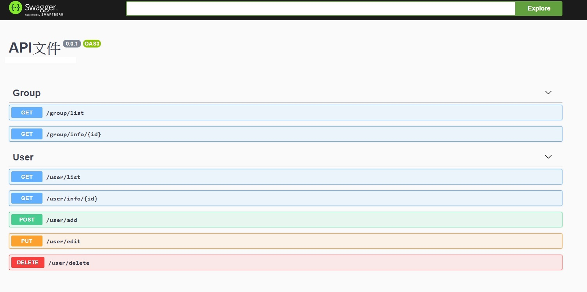

# Lumen + swagger sample

### Installation
```sh
$ cp .env.example .env
$ composer install
```
### Api文件

See [SwaggerLume](https://github.com/DarkaOnLine/SwaggerLume)

產生文件檔案:
```sh
$ php artisan swagger-lume:generate
```

產生路由:
```sh
$ http://yourdomain.com/api/documentation
```

精美api文件畫面


### Api debug

.env設定 APP_DEBUG=true
安裝 [chrome 套件](https://chrome.google.com/webstore/detail/clockwork/dmggabnehkmmfmdffgajcflpdjlnoemp)